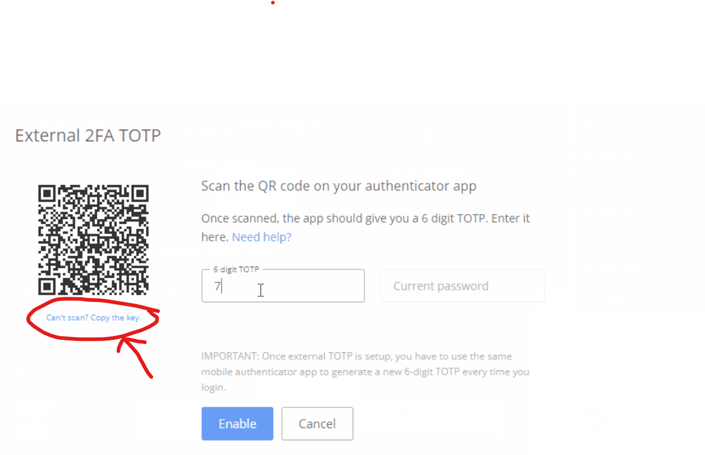

# APICostFree Zerodha Trade
### _An unofficial python library for zerodha trade_

## Prerequisites
* Python >= 3.7

## Requirments
* requests >= 2.28.1  ``` pip install requests```
* pyotp >= 2.8.0      ```pip install pyotp```
* pandas >= 1.5.0     ```pip install pandas```
* [Set TOTP login in Kite](https://support.zerodha.com/category/your-zerodha-account/login-credentials/login-credentials-of-trading-platforms/articles/time-based-otp-setup) (Remember to copy totpkey from  link below the QR code)


###### Update Config.ini USERINFO

```editorconfig

[USERINFO]
userid = VIKAS
password = Vikas@123
totpkey = ABCDRFGHIJKLMNOPQRSTUVWXYZ

[ENCTOKEN]
enctoken = qASlwVCUrOefHZ2LrxjVqtH1tkndKl8TvlFs2NyFuiVXctGlFpmRn4ec2feh48lZRcNMjeBfvlb1TvUcMDfyKjhE6ar+qhHe3xm3zEk7TEvDWAv4Wy6Feg==
```

How to use

```python
from PyKite import pykite
kite = pykite()
```

### Notes - You can use zerodha on kite App Mobile and algo in Browser using BrowserView.py
#### Requirement for BrowserView.py
* Chrome Browser
* selenium >= 4.10.0 ```pip install selenium```
* wedriver_manager >= 3.8.6 ```pip install webdriver_manager```


## Usages

### Accounts and trades details
```python
# Get user profile details.
print(kite.profile())

# Get account balance and cash margin.
print(kite.margins())

# Fetch all orders
print(kite.orders())

# Fetch all trades
print(kite.trades())

# Fetch all position
print(kite.positions())

# Get order history for particular order
print(kite.order_history('order_id'))

# Get trades history particular order
print(kite.order_trades('order_id'))
```

### Order placing and modify
```python
# Place an order
print(kite.place_order(variety=kite.VARIETY_REGULAR, 
                       exchange=kite.EXCHANGE_NSE, 
                       tradingsymbol="SBIN", 
                       transaction_type=kite.TRANSACTION_TYPE_BUY, 
                       quantity=10, 
                       product=kite.PRODUCT_CNC, 
                       order_type=kite.ORDER_TYPE_LIMIT, 
                       price=500))


# Modify an order
print(kite.modify_order(variety=kite.VARIETY_REGULAR, 
                        order_id='order_id', 
                        quantity="10", 
                        price=550, 
                        order_type=kite.ORDER_TYPE_LIMIT))

# Cancel an order
print(kite.cancel_order(variety=kite.VARIETY_REGULAR, 
                        order_id='order_id', 
                        parent_order_id='parent_order_id'))


# Convert position
print(kite.convert_position(exchange=kite.EXCHANGE_NSE,
                            tradingsymbol="SBIN",
                            transaction_type=kite.TRANSACTION_TYPE_BUY,
                            position_type=kite.POSITION_TYPE_DAY,
                            quantity=10,
                            old_product=kite.PRODUCT_CNC,
                            new_product=kite.PRODUCT_NRML))

```

### Calculate margin required of orders

```python
list_of_order = [{'exchange': 'NFO',
                  'tradingsymbol': 'BANKNIFTY2361544000CE',
                  'transaction_type': 'SELL',
                  'variety': 'regular',
                  'product': 'MIS',
                  'order_type': 'MARKET',
                  'quantity': 25,
                  'price': 0,
                  'trigger_price': 0,
                  'squareoff': 0,
                  'stoploss': 0},
                 {'exchange': 'NFO',
                  'tradingsymbol': 'BANKNIFTY2361544000PE',
                  'transaction_type': 'SELL',
                  'variety': 'regular',
                  'product': 'MIS',
                  'order_type': 'MARKET',
                  'quantity': 25,
                  'price': 0,
                  'trigger_price': 0,
                  'squareoff': 0,
                  'stoploss': 0}]

# Calculate margins considering the existing positions and open orders
print(kite.order_margins(list_of_order).json()['data'])

# Calculate total margins required including margin benefits
print(kite.basket_order_margins(list_of_order).json()['data'])
```
### Market Quotes

```python
instrument_list = ["NSE:SBIN", "NSE:HDFC", "NSE:RELIANCE"]

# Retrieve quote for list of instruments.
print(kite.quotes(instrument_list))

# Retrieve OHLC for list of instruments for current day.
print(kite.ohlc(instrument_list))

# Retrieve Last trade price for list of instruments.
print(kite.ltp(instrument_list))
```

### Instruments data

```python
# fetch all instruments
instrument_all = kite.instruments_data()
print(instrument_all)

# Fetch instrument for particular exchange
instrument_nse = kite.instruments_data("NSE")
print(instrument_nse)

# fetch and download instrument file to disk
instrument_nfo = kite.instruments_data("NFO", download=True, download_path="./instrument_nfo.csv")
print(instrument_nfo)
```

### Historical data

```python
instrument_nse = kite.instruments_data("NSE")
sbin_instrument_token = instrument_nse[instrument_nse['tradingsymbol']=="SBIN"]['instrument_token'].iloc[0]

json_data = kite.historical_data(sbin_instrument_token, 
                                 from_date="2021-01-01 00:00:00", 
                                 to_date="2023-01-01 00:00:00", 
                                 interval='day')

print(json_data['data']['candles'])
```
